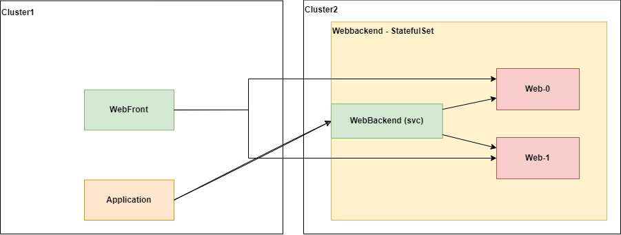

# POC accessing a single stateful set pod in a virtual mesh

## Description

For replication purposes, we want to be able to access a single pod within a stateful set. 

The application will still access the service endpoints, but in the example our WebFront-replicaset need to access directly a single pod in the stateful set in the other cluster.




## Deploying test code in a cluster


### 1. Deploying test pods

Assuming you already have two clusters, configured with a virtual mesh and GlooMesh, deploy the yaml-files:
```
kubectl --context atest-customer3-cluster1 apply -f cluster1
kubectl --context atest-customer3-cluster2 apply -f cluster2
```


### 2. Prepare the stateful set with test data
Connect to each stateful pod (replace X with 0 and 1)
```
kubectl exec -i -t -n default web-X -c webbackend -- sh -c "bash"
```

Run the commands for creating an index (replace X with 0 and 1):
```
echo "Hi from container X" > /usr/share/nginx/html/index.html
```


### 3. Verify connections

From webfront  in *cluster1*, you should be able to access the webbackend service in *cluster2*:

```
kubectl exec -i -t -n default webfront-deployment-0000000000-00000 -c webfront -- sh -c "bash"

# Install curl in the pod as it doesn't ship with it
apt update -y && apt install -y curl

# Test connection using the service
curl webbackend.default.svc.cluster2.global
```

The expected output is the nginx index page you created previously. You would get response from 0 and 1 about 50% of the time. 

### 4. The problem statement

For replication purposes, we might want to always connect to a spesific pod. 

Example, run from the same webfront pod with curl.

```
curl web-0.webbackend.default.svc.cluster2.global
```

Desired output is from pod 0. 

Actual output:
```
* Rebuilt URL to: web-0.webbackend.default.svc.cluster2.global/
* Could not resolve host: web-0.webbackend.default.svc.cluster2.global
* Closing connection 0
curl: (6) Could not resolve host: web-0.webbackend.default.svc.cluster2.global
```